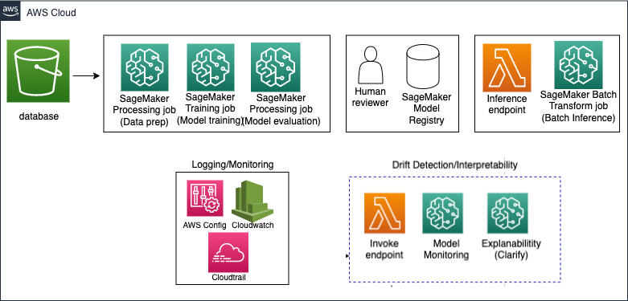

##  Welcome to MLOps pipeline project using Amazon SageMaker Pipelines

This project utilizes SageMaker Pipelines that offers machine learning (ML) application developers and operations engineers the ability to orchestrate SageMaker jobs and author reproducible ML pipelines. It enables users to deploy custom-build models for batch and real-time inference with low latency and track lineage of artifacts.

```
Key Hightlights:
--Visual map to monitor end to end data and ML pipeline progress
--Model Registry to main different model versions and associated metadata
--Access to SageMaker processing jobs to scale/distribute workloads across multiple instances
--Inbuilt workflow orchestration without the need to leverage Step Functions etc
--Human review component
--Model drift detection
```

## Code Layout
```
|-- data/        --> data file for inference purpose
|-- infra/       --> This folder contains helper function to create iam roles, policies
|-- README.md    --> The summary file of this project
|-- img/         --> images
|-- RegMLNB/     --> This folder contains files for data prep, model training, deployment and inference, model monitoring etc   
|-- pipeline.py  --> This file contain orchestration pipeline for data prep, model training,inference
|-- lambda_deployer.py --> Lambda function to create an endpoint
|-- requirements.txt --> This file contains project dependencies

```
## Architecture Diagram


## Data
fake_train_data.csv - This file has a randomly generated dataset, using Pythons random package. All labels and probability percentages are from a random number generator. It's used as a proof of concept for setting train set baseline statistics. 

## Get Started

This project is templatized with Amazon CDK. The `cdk.json` file tells the CDK Toolkit how to execute your app.

This project is set up like a standard Python project. The initialization process also creates a virtualenv within this project, stored under the `.venv` directory. To create the virtualenv it assumes that there is a python3 executable in your path with access to the venv package. If for any reason the automatic creation of the virtualenv fails, you can create the virtualenv manually once the init process completes.

To manually create a virtualenv on MacOS and Linux:
```
python3 -m venv .venv
```

After the init process completes and the virtualenv is created, you can use the following step to activate your virtualenv.
```
$ source .venv/bin/activate
```

Once the virtualenv is activated, you can install the required dependencies.
```
pip install -r requirements.txt
```

At this point you can now synthesize the CloudFormation template for this code.

```
cdk synth
cdk deploy --all --outputs-file ./cdk-outputs.json
```
or you can also deploy the stack by running : `cdk deploy regml-stack --outputs-file ./cdk-outputs.json`

Note: The output file parameter will automate the transfer of your created IAM role ARN to pipeline.py.

Once the stack is created, run the following command:
```
python pipeline.py
```

To add additional dependencies, for example other CDK libraries, just add to your requirements.txt file and rerun the `pip install -r requirements.txt` command.

Useful commands
```
`cdk ls` list all stacks in the app
`cdk synth` emits the synthesized CloudFormation template
`cdk deploy` deploy this stack to your default AWS account/region
`cdk diff` compare deployed stack with current state
`cdk docs` open CDK documentation
```

## Security

See [CONTRIBUTING](CONTRIBUTING.md#security-issue-notifications) for more information.

## License

This library is licensed under the MIT-0 License. See the LICENSE file.

